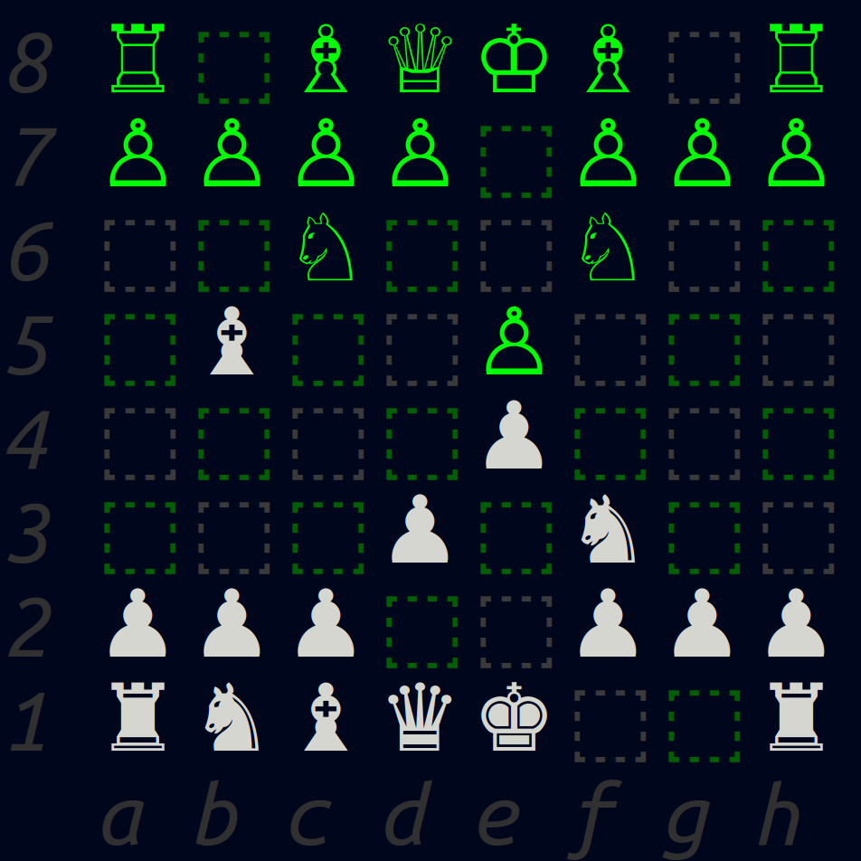

Artificial Intelligence Research Group [][1] 
Department of Mathematics and Computer Science [][2] 
Philosophisch-Naturwissenschaftliche Fakultät (Faculty of Science) [][3] 
University of Basel [][4]   

# Bachelor Thesis
  
## Single Player Chess

  The goal is to model a single-player Chess as a planning domain. We want to look into the problem of how to reach a given Chess position from an initial given position. As a first approach, one can encode this problem using PDDL. We also want to study how classical planners perform in this new domain and to implement a state-space search algorithm for this problem. 
 

## Authors

* Author: Ken Rotaris 
* Supervisor: Augusto B. Corrêa [][5]
* Professor: Prof. Dr. Malte Helmert [][6]

## Acknowledgments

* An Introduction to the Planning Domain Definition Language (Patrik Haslum) [][7]
* Planing.domains Tool [][8]

[1]: https://ai.dmi.unibas.ch/
[2]: https://dmi.unibas.ch/en/
[3]: https://philnat.unibas.ch/
[4]: https://www.unibas.ch/
[5]: https://ai.dmi.unibas.ch/people/correa/
[6]: https://ai.dmi.unibas.ch/people/helmert
[7]: https://www.morganclaypool.com/doi/abs/10.2200/S00900ED2V01Y201902AIM042
[8]: http://planning.domains/
